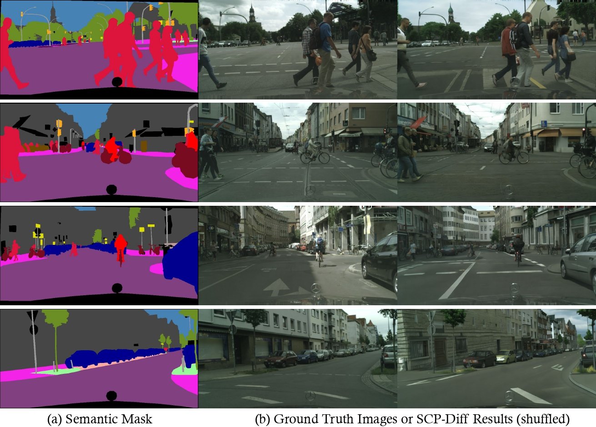

# SCP-Diff: Photo-Realistic Semantic Image Synthesis with Spatial-Categorical Joint Prior

This repository is an official implementation of SCP-Diff:

**SCP-Diff: Photo-Realistic Semantic Image Synthesis with Spatial-Categorical Joint Prior**

> Authors:  [_Huanang Gao_*](https://c7w.tech/about/), _Mingju Gao_*, _Jiaju Li_, _Wenyi Li_, _Rong zhi_, [_Hao Tang_](https://ha0tang.github.io/), [_Hao Zhao_](https://sites.google.com/view/fromandto)

Project Page: https://air-discover.github.io/



## Introduction
Semantic image synthesis (SIS) shows promising potential for sensor simulation. However, current best practices in this field, based on GANs, have not yet reached the desired level of quality. As latent diffusion models make significant strides in image generation, we are prompted to evaluate ControlNet, a notable method for its image-level control capabilities. Our investigation uncovered two primary issues with its results: the presence of weird sub-structures within large semantic areas and the misalignment of content with the semantic mask. Through empirical study, we pinpointed the root of these problems as a mismatch between the training-noised data distribution and the standard normal prior applied at the inference stage. To address this challenge, we developed specific noise priors for SIS, encompassing spatial, categorical, and an innovative spatial-categorical joint prior for inference. This approach, which we have named SCP-Diff, has yielded exceptional results, achieving an FID of **10.53** on Cityscapes and **12.66** on ADE20K.

## Environment Preparation
Create an enviroment. We use `torch==2.2.0+cu121`.
```bash
conda env create -f environment.yaml
conda activate scp-diff
```

## Dataset Preparation
We have prepared dataloaders for the Cityscapes, ADE20K, and COCO-Stuff datasets in the directory `datasets/`.

### Cityscapes
You can download cityscapes dataset from https://www.cityscapes-dataset.com/.

The file organization of the Cityscapes dataset is as follows:
```
├── cityscapes
│   ├── leftImg8bit
│   │   ├── train
│   │   ├── val
│   │   ├── test
│   ├── gtFine
│   │   ├── train
│   │   ├── val
│   │   ├── test
...
```  

```python
class CityscapesDataset(Dataset):
    RESOLUTION = (512, 1024)
    BASE = '/path/to/your/cityscapes/dataset'

    def __init__(self):
        super().__init__()
    ...
```
You need to set the root directory of the cityspaes dataset and specify the resolution for generated images by modifying the `BASE` and `RESOLUTION`. We use `512*1024` resolution.

### ADE20K
You can download ade20k dataset from https://groups.csail.mit.edu/vision/datasets/ADE20K/.

The file organization of the ade20k dataset is as follows:
```
├── ade20k
│   ├── annotations
│   │   ├── training # Gray-level annotations
│   │   ├── ...
│   ├── images
│   │   ├── training # RGB Images
│   │   ├── ...
...
```  
```python
class ADE20KDataset(Dataset):
    BASE = '/path/to/your/ade20k/dataset'
    RESOLUTION = (512, 512) 

    def __init__(self):
        super().__init__()
```

You need to set the root directory of the ade20k dataset and specify the resolution for generated images by modifying the `BASE` and `RESOLUTION`. We use `512*512` resolution.

### COCO-Stuff Dataset
You can download coco-stuff dataset from https://github.com/nightrome/cocostuff

The file organization of the coc-stuff dataset is as follows:
```
├── coco-stuff
│   ├── annotations
│   │   ├── train2017 # Gray-level annotations
│   │   ├── ...
│   ├── images
│   │   ├── train2017 # RGB Images
│   │   ├── ...
...
```  

```Python
class CocostuffDataset(Dataset):
    BASE = '/path/to/your/coco-stuff/dataset/'
    RESOLUTION = (384, 512) 

    def __init__(self):
```

You need to set the root directory of the coco-stuff dataset and specify the resolution for generated images by modifying the `BASE` and `RESOLUTION`. We use `384*512` resolution.


### Custome Your Own Dataset
You can custom your own dataset and write the dataloader following `datasets/*.py` You should have the original images, the gray-level semantic maps and colored semantic maps.

## Training
Run `tutorial_train.py` for training. We also release our training checkpoints in section ##Results##

```bash
python tutorial_train.py --batch_size <batch_size> --dataset ade20k --default_root_dir <log_root_dir> --gpus gpu_ids --resume_path <resume file path>
```
## Noise Prior Statistic
Next, we need to gather statistical information on the dataset's categorical and spatial information.

We can run `noise_prior.py`:
```bash
CUDA_VISIBLE_DEVICES=gpu_ids \
    python3 noise_prior.py --dataset ade20k --sample_size 10000 --save_name ade20k_10000 \
    --ckpt /path/to/ckpt --resolution 512 512 --save_dir ./statistics
```

You can refer to `noise_prior.py` for more details.

## Noise Prior Inference
Finally, we can use categorial and spatial prior to conduct more photorealistic inference. You can run `noise_prior_inference.py`

```bash
CUDA_VISIBLE_DEVICES=gpu_ids \
    python3 noise_prior_inference.py --dataset ade20k --sample_size <inference samples> --diffusion_steps <ddpm steps> --seed 4 --save_dir /path/to/save/infer/results \
    --spatial_scale 1.00 --class_scale 1.00 --batch_size <batch size> \
    --resolution <h> <w> --ckpt /path/to/ckpt \
    --stat_dir /path/to/statistics --stat_name <save_name of statistics> --scale <guidance scale>
```

You can refer to `noise_prior_inferecen.py` for more details.

We recommend you set the scale to `4.0` for `cityscapes` dataset, `7.5` for `ade20k` and `cocostuff` dataset

## Results 
|Method| |CS| | |ADE20K| |
|:----:|:----:|:----:|:----:|:----:|:----:|:----:|
| |mIoU|Acc|FID|mIoU|Acc|FID|
|Normal|23.35|65.14|94.14|20.73|61.14|20.58|
|Class Prior|11.63|66.86|94.54|21.86|66.63|16.56|
|Spatial Prior|12.83|66.77|94.29|20.86|64.46|16.03|
|Joint Prior|10.53|67.92|94.65|25.61|71.79|12.66|

And you can download checkpoints from our google drive:
|Dataset|Checkpoint|Statistic|
|:----:|:----:|:----:|
||